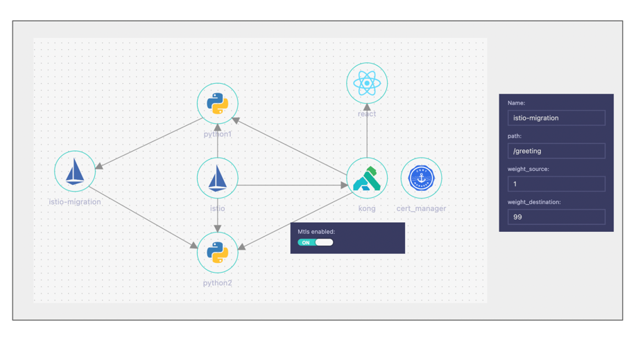

```
 curl python1.apps.source-lab.io/greeting                   
{
  "message": "Hello, welcome to the service!"
}
assafsauer@Assafs-MacBook-Pro canary % kubectl logs python2-779d548cbf-kg9x8  -n python2 |grep GET
2024-03-15 05:10:55,988 - werkzeug - INFO - 127.0.0.6 - - [15/Mar/2024 05:10:55] "GET /greeting HTTP/1.1" 200 -
2024-03-15 05:11:27,738 - werkzeug - INFO - 127.0.0.6 - - [15/Mar/2024 05:11:27] "GET /greeting HTTP/1.1" 200 -
```

notes: kubectl 